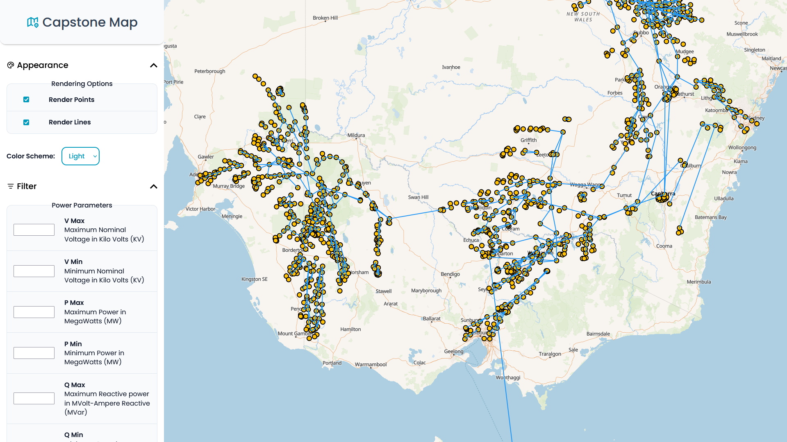

# Capstone Map

## Project Overview

This project was sponsored by Dr. Ana Goulart as part of the University of Canberra's ITS Capstone Program. Our team was tasked with visualizing a dataset produced by the CSIRO -- a synthetic model of the Australian Eastern Power Grid.

Our solution is a fully client-side web application that accepts geojson spatial data and visualizes it on a web map. This solution aids users in improving their understanding of the dataset in a visual and accessible way.

## User Guide

1. Navigate to the website [here](https://aps-x.github.io/Capstone/)
2. Click 'Import Data'
3. Click 'Browse' and select your geojson data
4. Press the 'Apply' button
5. Et voilà, enjoy your visualized data!

Note: The Synthetic NEM data is included by default on first visit. If you delete this data, you can find it in this repository within the data folder.

## Developer Guide

1. Install the 'Visual Studio Code' IDE
2. Install the 'Live Server' extension by Ritwick Dey
3. Install the 'Live Sass Compiler' extension by Glenn Marks
4. Install 'Inline HTML' extension by pushqrdx
5. Clone the repo with your preferred method of using Git version control

## Architecture & Design

[](./docs/ClassDiagram.svg)

### Technology Stack

| Category | Technology Used 
| :--- | :--- |
| **Markup** | HTML
| **Styling** | BEM CSS
| **Frontend** | JavaScript Custom Elements 
| **Database** | IndexedDB 
| **Infrastructure** | Github Pages & [OpenFreeMap](https://openfreemap.org/)
| **Libraries** | [MapLibre](https://github.com/maplibre/maplibre-gl-js), [Kmeans](https://github.com/mljs/kmeans)

#### Markup

Great care was taken to write semantic HTML because it makes the markup easier to read, improves accessibility, enhances search engine optimisation, and is simply the correct way to author websites.

#### Styling

I originally used a separate .scss file for each component, mimicking what MDN did for their web docs (yari). I later switched my approach to include the CSS within the component itself and then push the stylesheet to document.adoptedStylesheets. The BEM methodology was followed because it helps keep specificity low and organizes styles around components (i.e. blocks).

#### Frontend

JavaScript Custom Elements were used to organize the code around components. Web Components and the Shadow DOM were avoided because they prevent the use of utility classes and inheritance, they require workarounds to play nicely with forms and accessibility, and they just feel like they go against the grain of the web despite being a native API. JSDocs was used to help document the code. Here is an component:

```javascript
import './Button.js';
import { eventBus } from '../../core/EventBus.js';
import { EVENTS } from '../../core/Events.js';
//------------------------------------------------------------------------------------
/**
 * User Interface for viewing information regarding a clicked marker / bus.
 * @extends HTMLElement
 */
//------------------------------------------------------------------------------------
class MarkerPanel extends HTMLElement {
    static styles = new CSSStyleSheet();
    /** @type {HTMLButtonElement} */ #closeButton;
    /** @type {HTMLDListElement} */ #descriptionList;

    constructor() {
        super();
        eventBus.on(EVENTS.MAP_MARKER_CLICKED, (event) => this.#handleMapMarkerClicked(event));
    }

    connectedCallback() {
        this.classList.add('marker-panel');
        this.setAttribute('role', 'complementary');
        this.setAttribute('aria-hidden', 'true')
        this.#render();
        this.#initialize();
    }
        
    #render() {
        this.innerHTML = /*html*/`
            <header class="marker-panel__header | order-swap">
                <h2 class="marker-panel__title">Marker Info</h2>

                <button-x data-type="secondary"
                        type="button" 
                        aria-label="Close marker controls">
                    <span aria-hidden="true">X</span>
                </button-x>
            </header>

            <dl class="marker-panel__table">
            </dl>
        `;
    }

    #initialize() {
        this.#descriptionList = this.querySelector('dl');
        this.#closeButton = this.querySelector('button');

        this.#closeButton.addEventListener('click', () => this.#closeMarkerPanel())
    }

    /**
     * Renders a description list of marker info when a marker is clicked.
     * @param {Event} event The click event
     * @returns {void}
     */
    #handleMapMarkerClicked(event) {
        this.setAttribute("aria-hidden", "false");

        const markerProperties = event.detail;

        if (markerProperties == null) {
            console.warn("Map provided invalid marker properties to MarkerPanel");
        }

        this.#descriptionList.innerHTML = '';

        for (const [key, value] of Object.entries(markerProperties)) {
            const dt = document.createElement('dt');
            const dd = document.createElement('dd');

            dt.textContent = key;
            dd.textContent = value;
            
            dt.classList.add("marker-panel__key");
            dd.classList.add("marker-panel__value");

            this.#descriptionList.appendChild(dt);
            this.#descriptionList.appendChild(dd);
        }
    }

    /**
     * Toggles the visibility of the marker panel when the close button is clicked.
     * @returns {void}
     */
    #closeMarkerPanel() {
        this.setAttribute("aria-hidden", "true");
        eventBus.emit(EVENTS.MARKER_PANEL_CLOSED);
    }
}

customElements.define('marker-panel', MarkerPanel);

//------------------------------------------------------------------------------------
// Styles
//------------------------------------------------------------------------------------
MarkerPanel.styles.replaceSync(/*css*/`
    .marker-panel {
        display: none;
        grid-area: right;
        z-index: var(--z-sidebar);
        background-color: light-dark(var(--clr-white), var(--clr-slate-950));
        padding: 16px;
        padding-bottom: 64px;
        overflow: scroll;
    }
    @media only screen and (max-width: 768px) {
        .marker-panel {
            border-radius: 0px 0px 12px 12px;
        }
    }
    .marker-panel[aria-hidden=false] {
        display: block;
        animation: appear 0.25s;
    }
    .marker-panel__header {
        display: grid;
        grid-template-columns: auto 1fr;
        gap: 16px;
    }
    .marker-panel__title {
        font-size: var(--fs-200);
        font-weight: var(--fw-semi-bold);
        color: light-dark(var(--clr-blue-500), var(--clr-blue-400));
        align-self: center;
    }
    .marker-panel__table {
        display: grid;
        grid-template-columns: 1fr 1fr;
        margin-top: 32px;
        border: 1px solid light-dark(var(--clr-slate-300), var(--clr-slate-700));
        border-radius: 8px;
        overflow: hidden;
    }
    .marker-panel__key {
        background-color: light-dark(var(--clr-slate-100), var(--clr-slate-900));
        font-weight: var(--fw-semi-bold);
        border-right: 1px solid light-dark(var(--clr-slate-300), var(--clr-slate-700));
    }
    .marker-panel__key::first-letter {
        text-transform: uppercase;
    }
    .marker-panel__value {
        background-color: light-dark(var(--clr-white), var(--clr-slate-800));
    }
    .marker-panel__key, .marker-panel__value {
        padding: 12px 16px;
        border-bottom: 1px solid light-dark(var(--clr-slate-300), var(--clr-slate-700));
        min-width: 0;
        overflow-wrap: break-word;
        align-content: center;
    }
    .marker-panel__key:last-of-type, .marker-panel__value:last-of-type {
        border-bottom: none;
    }

    @keyframes appear {
        from {
            transform: translateX(25vw);
        }
        to {
            transform: unset;
        }
    }
`);

if (!document.adoptedStyleSheets.includes(MarkerPanel.styles)) {
    document.adoptedStyleSheets.push(MarkerPanel.styles);
}
```

#### Database

IndexedDB is used to handle the data that users can transfer to the website. It is a native, local solution that can handle gigabytes of data asynchronously without blocking the Event Loop. A simple wrapper was written around IndexedDB to make it usable with promises and async/await.

#### Infrastructure & Libraries

Github, OpenFreeMap, and MapLibre were chosen because they are free to use :)


## License

The Synthetic NEM dataset is licensed under CC-BY ([https://creativecommons.org/licenses/by/4.0/](https://creativecommons.org/licenses/by/4.0/)). More information on the dataset can be found [here](https://github.com/csiro-energy-systems/Synthetic-NEM-2000bus-Data).


## Acknowledgments

#### University of Canberra

Special thanks to Dr. Ana Goulart (Project Sponsor) and Jeanette Cotterill (Project Mentor) for their support and guidance over the course of this semester.

#### Academia

We would like to thank Frederik Geth, Ghulam Mohy Ud Din, and Matt Amos for sharing their expertise and helping us improve our understanding of the Synthetic NEM dataset.

* R. Heidari, M. Amos and F. Geth, "An Open Optimal Power Flow Model for the Australian National Electricity Market," 2023 IEEE PES Innovative Smart Grid Technologies - Asia (ISGT Asia), Auckland, New Zealand, 2023, pp. 1-5, doi: [10.1109/ISGTAsia54891.2023.10372618](https://doi.org/10.1109/ISGTAsia54891.2023.10372618)

* F. Arraño-Vargas and G. Konstantinou, "Modular Design and Real-Time Simulators Toward Power System Digital Twins Implementation," in IEEE Transactions on Industrial Informatics, doi: [10.1109/TII.2022.3178713](https://doi.org/10.1109/TII.2022.3178713)

* F. Arraño-Vargas and G. Konstantinou, "Synthetic Grid Modeling for Real-Time Simulations," 2021 IEEE PES Innovative Smart Grid Technologies - Asia (ISGT Asia), 2021, pp. 1-5, doi: [10.1109/ISGTAsia49270.2021.9715654](https://doi.org/10.1109/ISGTAsia49270.2021.9715654)

#### Web Development

* Kevin Powell for the accessible accordion
* Josh Comeau for the 3D button
* Adam Argyle for the picklist and toast components
* Wes Bos for the center truncating text trick
* CJ (Coding Garden) for the MapLibre and OpenFreeMap example
* Tabler.io for the svg icons
* The entire web development community for being so awesome and open to sharing knowledge

## Appendix

[](https://www.youtube.com/watch?v=aWfYxg-Ypm4)
